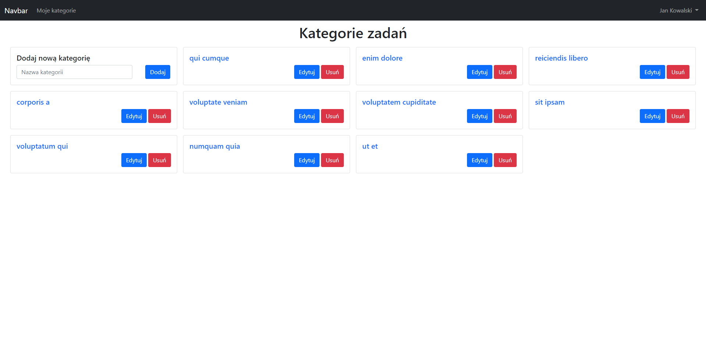
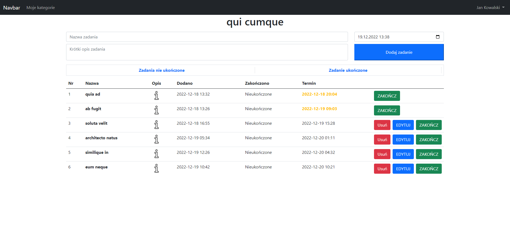
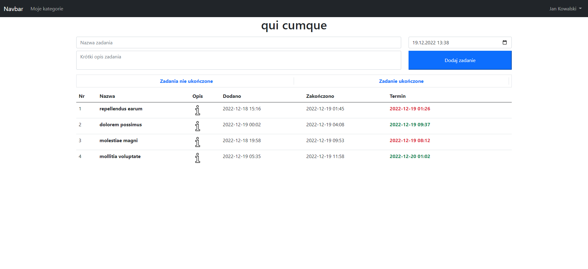

# TODO-APP [ LARAVEL ]
TODO project is a simple task management app. You can create multiple categories and then add tasks to them. This allows you to better organize your tasks and responsibilities and make it easier to accomplish them. The app is easy to use and allows you to quickly add new tasks and mark them as completed. TODO project is a great solution for those who want to better manage their time and achieve their goals.

## Build with
1. LARAVEl 8
2. BOOTSTRAP 5

## Features
1. Registration / Login
2. Category management
3. Task management

## Installation Instructions
1. Run `git clone https://github.com/dawidbros1/todo-app` 
2. Run `composer install` and `npm-install`
3. Create database for the project
4. Run `copy .env.example .env`
5. Configure your `.env` file 
6. Run `php artisan migrate`
7. Run `php artisan serve`

## Table of contents
- [Screenshots](#screenshots)
- [Commands](#commands)

## Screenshots

## Commands
`php artisan db:seed --class=DataSeeder` The command removes all data from database and next create users,categories and tasks
`php artisan db:seed --class=UserSeeder` The command adds users
`php artisan db:seed --class=CategorySeeder` The command add categories
`php artisan db:seed --class=TaskSeeder` The command add tasks

